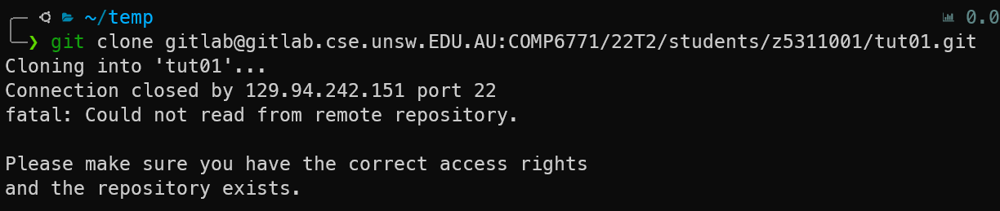
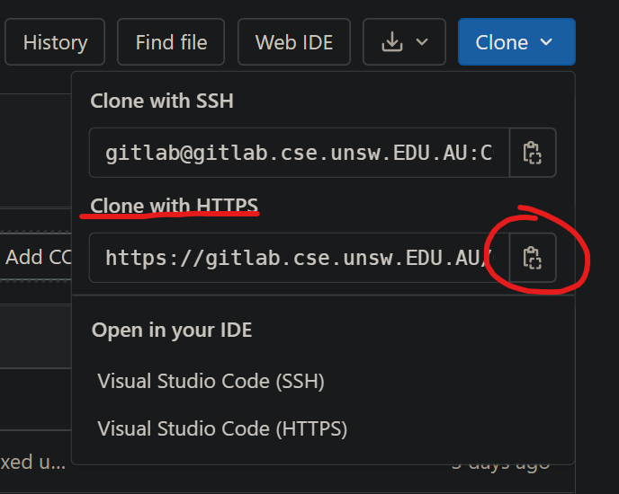
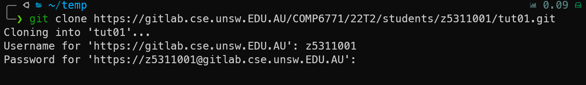
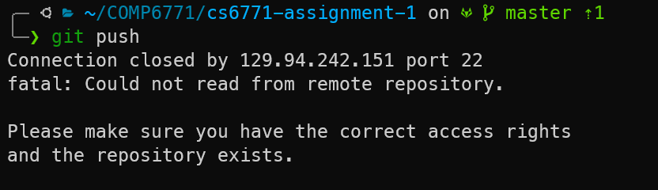
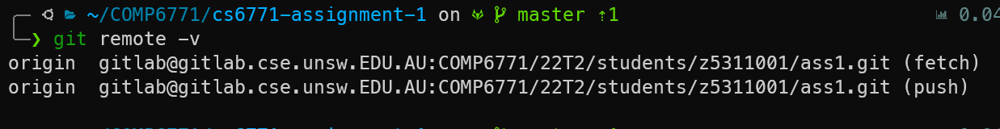
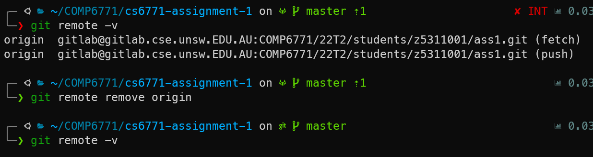
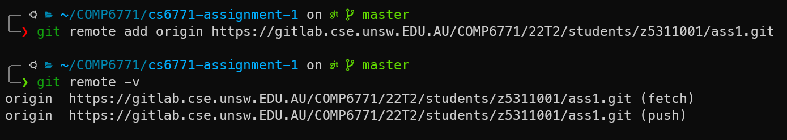
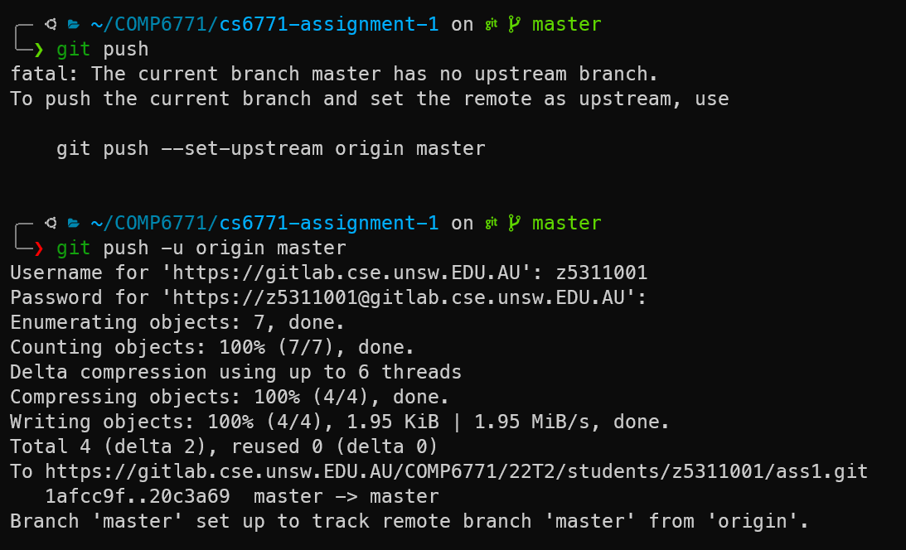

# 1. How to use GitLab via HTTPS

This guide will quickly run you through how to use GitLab via HTTPS.

**Please replace the links with your own repository links.** These are just examples.

# 2. I don't have an existing repository

If you don't have an existing repository and are trying to clone it like this:

```bash
git clone gitlab@gitlab.cse.unsw.EDU.AU:COMP6771/22T2/students/z5311001/tut01.git
```

You may get the error as such:



To fix this, find the HTTPS version of this link on GitLab as seen below:



Then attempt to `git clone` with that url. For example (replace this with your own link) but note how it now starts with `https://gitlab.cse...`

```bash
git clone addUrUrlHere
```



It will ask you for your `Username` which is your **zID** and `Password` which is your UNSW **zPass**.

After entering both details correctly, it should clone as normal.

# I already have my repository cloned, but cannot push

If you cloned your repository using the ssh version (via your SSH key), and get an error when trying to push:



It just means that we have to change our git repository to use the HTTPS version instead of the ssh version.

First, use:

```bash
git remote -v
```



This command lists the **remote urls**. Note how they currently look like `gitlab@gitlab.cse...`. We want to change this so that it looks like `https://gitlab.cse...`.

Next, get your HTTPS link from GitLab as seen here:


Then, we remove the old remote using:

```bash
git remote remove origin
```



Now we have removed the origin remote, `git remote -v` will show nothing now.

Next, we re-add the origin remote with the HTTPS link using (use your own link):

```bash
git remote add origin addUrUrlHere
```



Now we can try to use `git push`. You will see an error saying that there is no upstream branch. To fix this, we can use:

```bash
git push -u origin master
```

or

```bash
git push --set-upstream origin master
```

This command only needs to be used **once**.

It will ask you for your `Username` which is your **zID** and `Password` which is your UNSW **zPass**.


